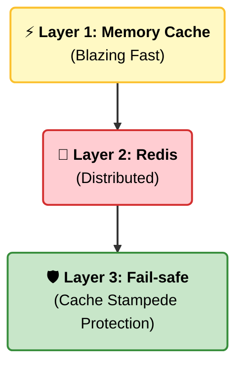
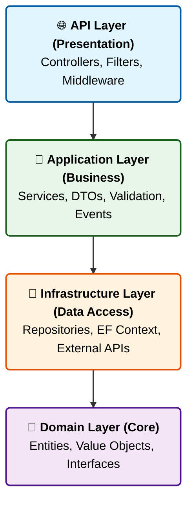

<div align="center">

# 🏢 ERP ENGINE


<h3>🚀 Production-Ready ERP Backend Foundation</h3>
<h4>Built with .NET 10 & Clean Architecture</h4>

> 💎 **A high-performance, Scalable And Secure Enterprise Resource Planning system**
> 
> ⚡ Engineered for scalability, tenancy isolation, and architectural strictness

[**🎯 Features**](#-key-features--engineering-highlights) • [**🏗 Architecture**](#-architecture) • [**💾 Database**](#%EF%B8%8F-database-architecture--design)

---

</div>

## 📋 Table of Contents

- [🌟 Overview](#-overview)
- [✅ Business Modules](#-business-modules-capabilities)
- [🚀 Engineering Highlights](#-key-features--engineering-highlights)
- [🗄️ Database Design](#%EF%B8%8F-database-architecture--design)
- [🛠 Technology Stack](#-technology-stack)
- [🏗 Architecture](#-architecture)
- [📁 Project Structure](#-project-structure)
- [👨‍💻 Author](#-author)

<br/>

---

## 🌟 Overview

<div align="center">

**ERP Core** is a **technical showcase** designed to demonstrate advanced backend engineering capabilities.  
It serves as a comprehensive proof-of-concept for building **complex, high-throughput enterprise systems** using the latest .NET ecosystem standards.

</div>

<br/>

This repository is not just a starter kit; it is a **portfolio piece** highlighting my ability to architect scalable solutions. It moves beyond simple CRUD operations to tackle real-world engineering challenges like **Data Isolation**, **Concurrency Handling**, and **Architectural Strictness**.

<br/>

### 💡 Engineering Mastery Showcase

<table>
<tr>
<td width="50%">

#### 🛡️ Architectural Discipline
Demonstrating strict adherence to **Clean Architecture** (Onion) to prove the ability to write maintainable, testable, and loosely coupled code.

#### 🚀 Performance Optimization
Showcasing deep knowledge of **Database Engineering** (PostgreSQL) and caching strategies (Redis/FusionCache) to handle scale.

</td>
<td width="50%">

#### 🏢 Complex System Design
Evidence of capability in building **Multi-Tenant SaaS** systems, handling the complexities of shared resources and data security.

#### 🔧 Advanced Implementation
Highlighting proficiency in **Design Patterns** (CQRS, Mediator, Specification) and writing clean, production-grade C# code.

</td>
</tr>
<tr>
<td colspan="2" align="center">

#### ☁️ Modern DevOps Mindset
Proving familiarity with containerization (**Docker**) and modern deployment workflows.

</td>
</tr>
</table>

<br/>

---

<div align="center">

## ✅ BUSINESS MODULES CAPABILITIES

</div>

| Module | Core Capabilities |
|:------:|:-----------------|
| **🏢 Multi-Tenancy** | `Tenant Isolation` • `Subscription Management` • `Invitation System` • `Module-level Permissions` |
| **📦 Product Catalog** | `Variant Management (Matrix)` • `Dynamic Attributes (EAV)` • `UoM Conversion` • `Multi-currency Pricelists` |
| **🏭 Inventory** | `Multi-Warehouse` • `Real-time Stock Tracking` • `Reserved/Available Qty` • `Stock Movements & Transfers` |
| **💰 Financials** | `Tax Engine (Fixed/Percentage)` • `Invoice Generation` • `Payment Reconciliation` • `Multi-Currency Support` |
| **👤 Administration** | `RBAC (Role-Based Access)` • `Audit Logging` • `User Activity Tracking` • `Security Settings` |

<br/>

---

## 🚀 Key Features & Engineering Highlights

<br/>

### 🏗 **High-Performance Architecture**

<table>
<tr>
<td width="33%">

**Clean Architecture** Strict separation of concerns  
(API → Application → Infrastructure → Domain)  
following **SOLID principles**

</td>
<td width="33%">

**Modular Design** A decoupled, domain-centric  
modular monolith structure  
for seamless extension

</td>
<td width="33%">

**Mediator Pattern** Utilizing **MediatR** for  
handling domain events  
efficiently

</td>
</tr>
</table>

<br/>

### 💾 **Advanced Database Engineering (PostgreSQL 17)**

<details>
<summary><b>🔍 Click to expand Database Highlights</b></summary>

<br/>

- **Heavy Lifting in DB:** Offloading critical transactional logic to **63+ Stored Functions (PL/SQL)** to ensure atomicity and data consistency.
- **Optimized for Search:** Implementation of **GIN Indexes (pg_trgm)** for high-performance full-text fuzzy search capabilities.
- **Data Integrity First:** Extensive use of **Computed Columns**, Database Constraints, and Custom ENUM types to enforce business rules at the persistence layer.
- **Concurrency Control:** Leveraging PostgreSQL's MVCC and Optimistic Concurrency for high-throughput environments.

</details>

<br/>

### ⚡ **Performance & Resilience at Scale**



* **Resilience Patterns:** Integrated **Polly** for retry policies, circuit breakers, and bulkhead isolation to handle transient failures gracefully.
* **High-Speed I/O:** Full usage of **Async/Await**, Connection Pooling, and Response Compression (Gzip/Brotli) for bandwidth optimization.

### 🔐 **Enterprise Security & Multi-Tenancy**

<table>
<tr>
<td align="center">🏢</td>
<td><b>SaaS Multi-Tenancy</b>


Complete data isolation using <code>tenant_id</code> Row-Level Security</td>
</tr>
<tr>
<td align="center">🔑</td>
<td><b>Identity System</b>


Secure JWT Authentication with Refresh Token Rotation & <b>Argon2</b> hashing</td>
</tr>
<tr>
<td align="center">🛡️</td>
<td><b>Defense in Depth</b>


Rate Limiting (Sliding Window), IP-based blocking, strict Input Validation</td>
</tr>
</table>

### 🧪 **Gold-Standard Quality Assurance**

<div align="center">

| Feature | Implementation |
| --- | --- |
| **Integration Testing** | Real-world scenarios tested using **Testcontainers** (Running real PostgreSQL instance in Docker). |
| **Unit Testing** | Business logic isolation using **xUnit** and **FluentAssertions**. |
| **Static Analysis** | Strict styling and architectural rules enforced via Roslyn Analyzers. |

</div>

### 🛠 **Developer Experience (DX)**

> **Modern Documentation** • **Observability** • **Background Processing** • **Production-Ready**

* 📚 Interactive API documentation using **OpenAPI/Scalar** with generated schemas
* 📊 Structured logging via **Serilog** (JSON formatted) and comprehensive Health Checks
* ⚙️ Reliable async task processing using **Hangfire** backed by PostgreSQL storage
* 🐳 Fully containerized setup with **Docker** and Docker Compose for immediate deployment

---

## 🧠 Design Patterns & Engineering Practices

<div align="center">

The codebase strictly adheres to **SOLID principles** and industry-standard design patterns

</div>

<table>
<tr>
<td width="50%">

**🏛️ Structural Patterns**

* Repository & Unit of Work
* Specification Pattern
* Factory Pattern

</td>
<td width="50%">

**🎯 Behavioral Patterns**

* Result Pattern
* Domain Events
* Mediator Pattern

</td>
</tr>
</table>

<details>
<summary><b>📖 Pattern Details & Implementation</b></summary>

* **Repository & Unit of Work:** Abstraction over EF Core for testability, with **Dapper** used for high-performance complex reads.
* **Specification Pattern:** Encapsulating query logic for reusable filtering (especially for multi-tenancy).
* **Factory Pattern:** Used for complex object creation (e.g., Database Connections).
* **Result Pattern:** Standardized functional approach for handling success/failure responses without throwing exceptions.
* **Domain Events:** Decoupling side effects (e.g., "Stock Updated" → "Update Cache") using MediatR notifications.

</details>

---

## 📸 API Documentation Preview (Scalar)

<div align="center">


</div>

## Code Snipets

<div align="center">


<br/>

<br/>

<br/>

<br/>

<br/>

<br/>

<br/>

<br/>

<br/>

<br/>

<br/>

<br/>

</div>

## 🗄️ Database Architecture & Design

<div align="center">

The system relies on a heavily optimized **PostgreSQL 17** database

designed for multi-tenant heavy workloads.

**We prioritize Data Integrity and Performance at the database level.**

### 📊 ENTITY RELATIONSHIP DIAGRAM (ERD)

<div align="center">

> 📐 **The schema features 90+ normalized tables**
> Covering Identity, Inventory, Accounting, and CRM modules

</div>

<div align="center">


> 🗂️ **Complete Entity Relationship Diagram**
> Showing all database tables, relationships, and constraints

</div>

</div>

### 🎯 **Advanced PL/SQL Implementation**

Unlike typical ORM-only applications, this engine offloads complex transactional logic

to the database to ensure **atomicity** and **performance**.

<div align="center">

#### 📈 Key Database Metrics

| Metric | Count | Purpose |
| --- | --- | --- |
| **🔍 Indexes** | `183` | Strategic indexing (B-tree for FKs, GIN for Search, Partial Indexes) |
| **⚙️ Stored Functions** | `63` | Safe Deletes, Complex Validations, Ledger Calculations |
| **🧮 Computed Columns** | `-` | Automatic calculation of Inventory Availability & Invoice Totals |

<div align="center">


> ⚡ **Example: Safe Delete Stored Function**
> Protecting data integrity across modules with PL/pgSQL

</div>

</div>

---

## 🛠 Technology Stack

### **🎯 Backend Framework**

<div align="center">

</div>

### **💾 Database & Caching**

<div align="center">

</div>

### **📚 Key Libraries**

<div align="center">

| Purpose | Library | Version |
| --- | --- | --- |
| 🔐 **Authentication** | JWT Bearer | `10.0+` |
| ✅ **Validation** | FluentValidation | `12.1+` |
| 🗺️ **Mapping** | AutoMapper | `16.0+` |
| 🔒 **Password Hashing** | Argon2 | `2.0+` |
| ⚙️ **Background Jobs** | Hangfire | `1.8+` |
| 📊 **Logging** | Serilog | `10.0+` |
| 🛡️ **Resilience** | Polly | `8.6+` |
| 📣 **Notifications** | MediatR | `14.0+` |

</div>

### **🐳 DevOps**

<div align="center">

</div>

---

<div align="center">

## 🏗 ARCHITECTURE

### Clean Architecture (Onion Architecture)

> 🎯 **Four Distinct Layers with Clear Separation of Concerns**
> Following SOLID principles and dependency inversion



</div>

### **📋 Layer Responsibilities**

<table>
<tr>
<td width="25%" align="center">

**🌐 API** HTTP endpoints

Request/Response

Authentication

</td>
<td width="25%" align="center">

**💼 Application** Business logic

Validation

Caching

</td>
<td width="25%" align="center">

**🔧 Infrastructure** Database access

External services

File storage

</td>
<td width="25%" align="center">

**🎯 Domain** Core entities

Business rules

No dependencies

</td>
</tr>
</table>

---

## 📁 Project Structure

```
ERP-Core/
│
├── 📂 API/                          # 🌐 Presentation Layer
│   ├── Controllers/                 # API Endpoints
│   │   ├── Administration/          # 👤 Auth & User Management
│   │   ├── ProductManagement/       # 📦 Product Catalog
│   │   ├── Inventory/               # 🏭 Warehouse Management
│   │   ├── Financials/              # 💰 Tax & Financial
│   │   └── Common/                  # 🛠️ Utilities
│   ├── Extensions/                  # 🔌 DI Registration
│   ├── Filters/                     # 🛡️ Global Exception Handler
│   ├── Program.cs                   # 🚀 Application Entry Point
│   └── appsettings.json             # ⚙️ Configuration
│
├── 📂 Application/                  # 💼 Application Layer
│   ├── Administration/              # 🔐 Auth, Users, Tenants
│   ├── ProductManagement/           # 📦 Product Business Logic
│   ├── Inventory/                   # 🏭 Warehouse Services
│   ├── Financials/                  # 💰 Tax Services
│   └── Core/                        # 🧩 Common Services, Email
│
├── 📂 Domain/                       # 🎯 Domain Layer
│   ├── Administration/              # 👤 User Entities
│   ├── ProductManagement/           # 📦 Product Entities (via Data/)
│   ├── Inventory/                   # 🏭 Warehouse Entities
│   ├── Financials/                  # 💰 Financial Entities
│   ├── Data/                        # 📊 All Entity Models
│   └── DBContext/                   # 🗄️ EF Core DbContext
│
├── 📂 Infrastructure/               # 🔧 Infrastructure Layer
│   ├── Administration/              # 🔐 User Repositories
│   ├── ProductManagement/           # 📦 Product Data Access
│   ├── Inventory/                   # 🏭 Warehouse Repositories
│   ├── Financials/                  # 💰 Financial Repositories
│   └── Core/                        # 🧩 Common Infrastructure
│
├── 🐳 docker-compose.yml            # 🐳 Docker Orchestration
├── 🐳 Dockerfile                    # 📦 Container Definition
└── 📖 README.md                     # 📚 Documentation

```

---

---

## 🔒 Source Code Access

> **⚠️ Proprietary Commercial Software**
> This repository serves as a **technical architecture showcase**. The full source code is not publicly available to protect intellectual property rights.
> However, I am available to provide a **code walkthrough** during technical interviews to demonstrate:
> * The full implementation of the **Multi-Tenant Architecture**.
> * The **Complex PL/pgSQL Stored Functions**.
> * The **Integration Tests** using Testcontainers.
> 
> 
> *Feel free to contact me for a detailed technical discussion.*

<div align="center">

## 👨‍💻 Author

### **Mohamed Elmonier**

*Backend Developer | .NET Specialist*

---

### ⚡ **Engineered with .NET 10**

*A showcase of high-performance system design and advanced software architecture.* *Demonstrating the implementation of complex business logic within a clean, scalable environment.*

</div>

```

```
